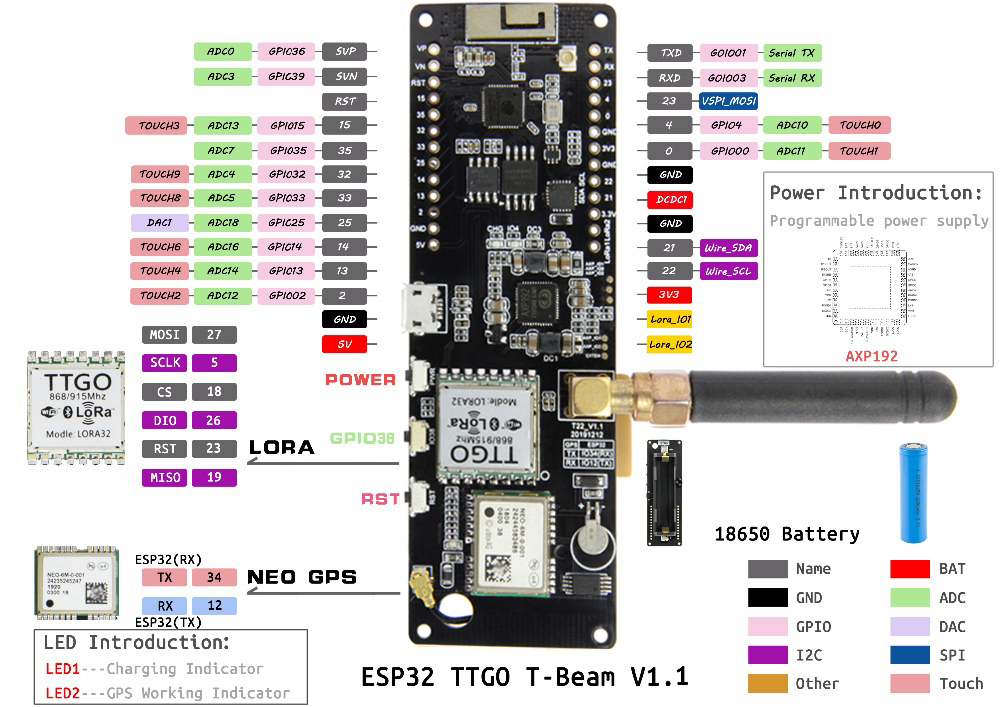
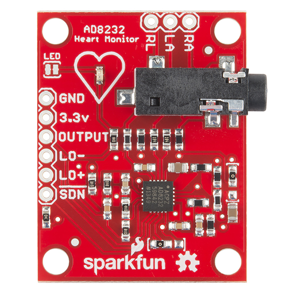

# Repository for the Smart Sport Shirt Project

## Dependencies
- TinyGP++ Library
- ESP32 TTGO T-Beam library from espressif

## Components
This Project uses the TTGO T-Beam v1.1

| T-Beam | AD8232 |
| -- 	 | --	  |
| VP 	 | Output |
| 15 	 | LO+	  |
| 35 	 | LO-	  |
| -    | SDN    |

And a AD8232 ECG Sensor
